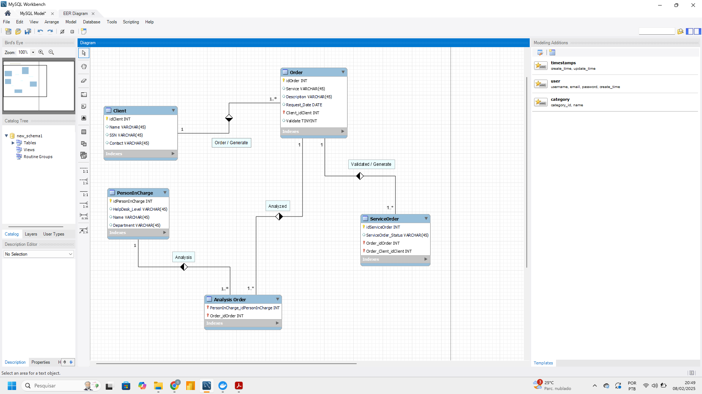

# 📌 Construa um Projeto Lógico de Banco de Dados do Zero

---

## 📜 Descrição do Projeto Lógico

Este projeto de banco de dados foi modelado para gerenciar ordens de serviço, clientes e responsáveis por análises. A estrutura lógica do banco de dados é composta pelas seguintes tabelas:

1. **Client**: Armazena informações dos clientes, como identificador, nome, número de identificação social (SSN) e contato.

2. **Order**: Representa as ordens de serviço realizadas pelos clientes. Contém campos como o identificador da ordem, o serviço prestado, uma descrição, data de solicitação, referência ao cliente e um campo de validação.

3. **PersonInCharge**: Contém informações sobre as pessoas responsáveis por análises de ordens, incluindo o nível de suporte técnico (HelpDesk_Level), nome e departamento.

4. **Analysis Order**: Tabela intermediária que registra quais responsáveis realizaram a análise de uma determinada ordem. Relaciona a tabela `Order` com a tabela `PersonInCharge`.

5. **ServiceOrder**: Armazena o status das ordens de serviço validadas. Contém o identificador do serviço, o status da ordem, a referência à `Order` e ao cliente correspondente.

### 🎯 Funcionamento das Tabelas

- A tabela `Client` é relacionada com `Order`, onde cada cliente pode realizar múltiplas ordens.
- A tabela `Order` pode ser analisada por diferentes responsáveis na tabela `PersonInCharge` através da tabela intermediária `Analysis Order`.
- Uma vez analisada, a `Order` pode ser validada e gerar um registro na tabela `ServiceOrder` para acompanhar o status da ordem.

A estrutura lógica permite a rastreabilidade do ciclo de vida das ordens, desde a solicitação do cliente até a análise e validação do serviço.
