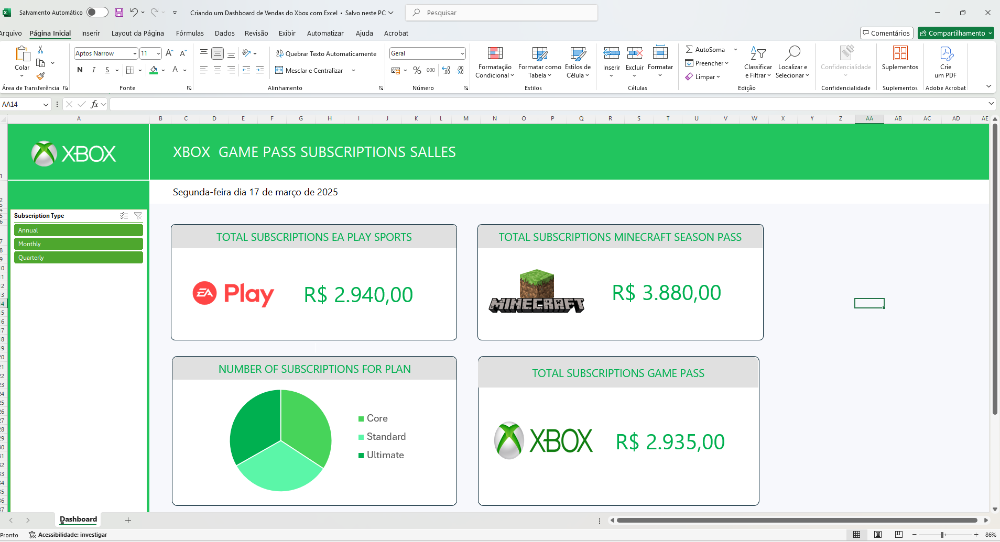

# 📌 Criando um Dashboard de Vendas do Xbox com Excel

---

## 📜 Descrição do desafio

O desafio consiste em desenvolver um Dashboard de Vendas no Excel para acompanhar e visualizar o desempenho das assinaturas do Xbox Game Pass e seus diferentes planos. O objetivo principal é transformar dados brutos em gráficos e indicadores visuais, permitindo uma análise eficiente das vendas e auxiliando na tomada de decisões estratégicas.

### 🎯Descrição dos Dados

#### 1. Total de Assinaturas por Serviço

- **EA Play Sports:** Indica a receita total gerada pelas assinaturas do serviço EA Play Sports.

- **Minecraft Season Pass:** Apresenta o total arrecadado com assinaturas do Minecraft Season Pass, permitindo avaliar sua popularidade.

- **Xbox Game Pass:** Mostra o total de receitas provenientes do Xbox Game Pass, facilitando o acompanhamento do impacto financeiro desse serviço.

#### 3. Distribuição das Assinaturas por Plano

- Representada por um gráfico de pizza, essa seção exibe a participação percentual de cada plano: Core; Standard; Ultimate.

- Permite identificar quais planos têm maior adesão e quais necessitam de melhorias na estratégia de vendas.

#### 4. Filtro "Subscription Type"

- **Opções:** Annual (Anual), Monthly (Mensal) e Quarterly (Trimestral).

- Permite segmentar os dados com base no período de assinatura, ajudando a entender quais períodos têm maior aceitação entre os usuários.
